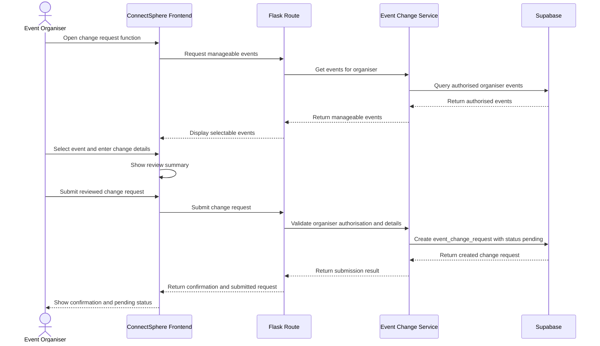

# Request Event Changes - Sequence Diagram

```mermaid
sequenceDiagram
    actor Organiser as Event Organiser
    participant Frontend as ConnectSphere Frontend
    participant Route as Flask Route
    participant Service as Event Change Service
    participant DB as Supabase

    Organiser->>Frontend: Open change request function
    Frontend->>Route: Request manageable events
    Route->>Service: Get events for organiser
    Service->>DB: Query authorised organiser events
    DB-->>Service: Return authorised events
    Service-->>Route: Return manageable events
    Route-->>Frontend: Display selectable events

    Organiser->>Frontend: Select event and enter change details
    Frontend->>Frontend: Show review summary
    Organiser->>Frontend: Submit reviewed change request
    Frontend->>Route: Submit change request
    Route->>Service: Validate organiser authorisation and details
    Service->>DB: Create event_change_request with status pending
    DB-->>Service: Return created change request
    Service-->>Route: Return submission result
    Route-->>Frontend: Return confirmation and submitted request
    Frontend-->>Organiser: Show confirmation and pending status
```
